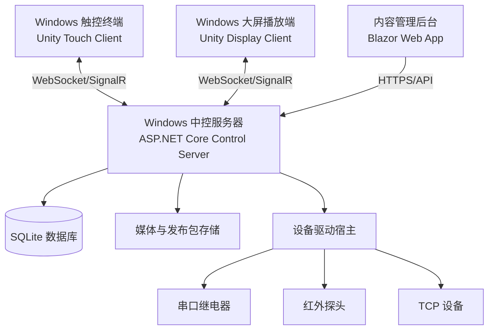
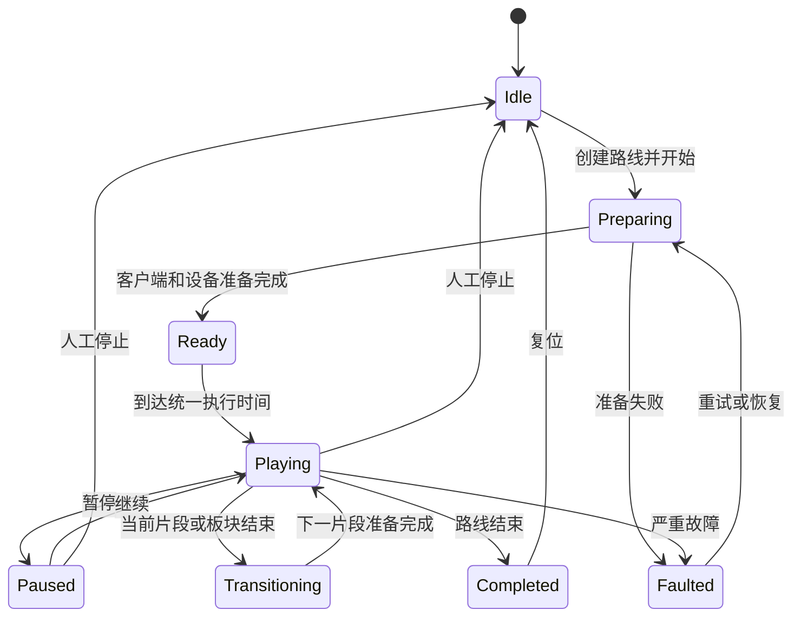

# 软件架构设计

## 1. 架构目标

- 内容可配置：板块、路线、语音、媒体和设备动作不写死在 Unity 场景中。
- 服务器权威：服务器是讲解状态和时间线的唯一权威，两个 Unity 客户端只执行和上报。
- 双屏同步：触控端负责操作，大屏端负责演示，使用预加载和计划执行时间保证同步。
- 协议可扩展：串口继电器、红外探头、TCP 设备通过独立驱动接入。
- 故障可恢复：客户端、服务器或网络短暂异常后能够恢复当前任务。
- 可运维：具备内容发布、版本回滚、日志查询、设备诊断和远程维护能力。

## 2. 总体拓扑



部署原则：服务器和无线 AP 使用有线连接；触控端可使用 Wi-Fi；大屏端优先有线，必须无线时采用本地素材缓存，不实时串流大体积视频。

## 3. 技术栈

| 层级 | 技术 | 用途 |
|---|---|---|
| 触控客户端 | Unity 6.3 LTS、C# | 触控 UI、路线选择、讲解控制、状态显示 |
| 大屏客户端 | Unity 6.3 LTS、C# | 4K 媒体、动画、字幕、语音及时间线执行 |
| 中控服务 | .NET 10 LTS、ASP.NET Core、Windows Service | 会话编排、同步、内容、设备、日志与 API |
| 实时通信 | SignalR/WebSocket | 命令、状态、心跳、时间同步 |
| 管理后台 | Blazor Web App | 内容、路线、设备、发布、日志与用户管理 |
| 数据存储 | SQLite + 文件存储 | 配置和业务数据；媒体按文件及哈希管理 |
| 设备接入 | .NET 驱动插件 | 串口、红外、TCP 及后续协议 |
| 日志 | 结构化文件日志 + 数据库索引 | 运行、操作、通信和故障追踪 |

所有服务端组件采用自包含发布，安装时不依赖目标机器预装 .NET Runtime。Unity 和 .NET 版本在首个可交付版本后锁定，升级必须经过完整回归测试。

## 4. 运行节点职责

### 4.1 Unity 触控客户端

- 待机页、首页、板块浏览和缩略图滚动。
- 显示全部板块和后台发布的最新顺序。
- 一键开始完整讲解。
- 勾选任意板块并拖动排序，生成临时组合路线。
- 选择后台预设路线，如完整路线、重点路线、领导参观路线。
- 开始、暂停、继续、上一板块、下一板块、跳转和停止。
- 显示当前板块、总进度、剩余时间、服务器和大屏连接状态。
- 操作请求只发送到服务器，不直接决定大屏或设备最终状态。
- 本地缓存配置、缩略图和必要素材，断线时进入受控降级状态。
- 支持开机启动、全屏、隐藏系统桌面入口和维护员退出方式。

### 4.2 Unity 大屏客户端

- 下载并校验服务器发布的内容包。
- 本地缓存图片、视频、音频、字幕和配置。
- 预加载下一讲解片段，避免切换黑屏和卡顿。
- 按服务器下发的 `executeAt` 时间启动、暂停、继续、跳转和停止。
- 支持图片、视频、序列动画、Unity 动画、字幕及待机画面。
- 按确定后的音频拓扑播放讲解语音，或与独立音频设备联动。
- 周期上报播放位置、素材版本、帧率、错误和缓存状态。
- 检测时间漂移，按策略微调、跳转或重新同步。
- 网络短暂中断时完成当前本地片段，并等待恢复策略。

### 4.3 中控服务器

- 管理客户端注册、身份、在线状态和心跳。
- 保存板块、片段、路线、时间线、设备和发布版本。
- 创建并维护唯一的讲解运行会话。
- 执行讲解状态机和时间线调度。
- 协调大屏准备、设备准备和统一计划启动。
- 控制暂停、继续、跳转、停止和异常恢复。
- 调用设备驱动并收集设备状态。
- 发布内容包、检查客户端版本并支持回滚。
- 记录操作、命令、确认、超时、重试和故障。
- 提供管理后台 API 和实时状态推送。

### 4.4 管理后台

- 板块新增、编辑、停用、删除和排序。
- 讲解片段、讲解词、字幕和语音配置。
- 图片、视频、音频等素材上传、预览、替换和版本管理。
- 时间线编辑：媒体切换、语音、字幕和设备动作。
- 路线编辑：全部板块、任意组合、顺序和预设路线。
- 设备、连接参数、命令模板、超时和重试策略配置。
- 内容校验、发布、客户端下载状态和版本回滚。
- 在线设备、当前任务、故障、日志和操作审计查看。
- 管理员、内容编辑员和操作员权限区分。

## 5. 核心领域模型

| 模型 | 说明 |
|---|---|
| ExhibitModule | 一个展厅板块，数量动态可变 |
| NarrationSegment | 板块内的一个讲解片段 |
| MediaAsset | 图片、视频、音频、字幕或其他资源 |
| TimelineAction | 指定时间执行的媒体、语音、字幕或设备动作 |
| TourRoute | 一条完整或组合讲解路线 |
| RouteItem | 路线中的板块、顺序和个性化参数 |
| Device | 一个物理设备或逻辑设备 |
| DeviceCommandTemplate | 可配置的设备命令模板 |
| RunSession | 一次讲解运行及其当前状态 |
| ClientNode | 触控端、大屏端或其他客户端实例 |
| ContentRelease | 一次可部署、可校验、可回滚的内容版本 |
| EventLog | 操作、通信、设备和故障事件 |

## 6. 讲解状态机



任何客户端都不能绕过服务器自行改变全局状态。重复命令必须幂等，避免网络重发造成重复播放或继电器重复动作。

## 7. 音画与设备同步

采用“准备 - 确认 - 计划执行”流程：

1. 服务器创建本次讲解会话并锁定路线版本。
2. 服务器向大屏端发送素材和场景准备命令。
3. 大屏端完成本地预加载并返回 `Prepared`。
4. 必要设备驱动完成进入动作并返回结果。
5. 服务器下发带未来统一时间 `executeAt` 的开始命令。
6. 大屏、语音和设备按计划执行；触控端只显示权威状态。
7. 大屏端持续上报播放位置，服务器检测漂移和异常。

同步不能依赖无线网络实时传输视频。所有正式媒体应在讲解前发布并缓存到播放端，运行时网络只传输控制、状态和少量配置。

## 8. 设备驱动架构

统一驱动接口至少包含：连接、断开、健康检查、执行命令、读取状态、取消命令和释放资源。

首批驱动：

- `SerialRelayDriver`：串口继电器开、关、脉冲和通道状态。
- `InfraredSensorDriver`：红外触发输入、状态变化、防抖和触发规则。
- `TcpDeviceDriver`：TCP 长连接或短连接、报文编解码、心跳和重连。

后续可以在不修改讲解引擎的情况下增加 HTTP、UDP、Modbus RTU/TCP、投影机、灯光、音响等驱动。

## 9. 故障恢复策略

- 触控端断线：禁用新的高风险操作，保留当前状态显示并自动重连。
- 大屏端断线：服务器暂停进入下一片段；恢复后校验会话和素材版本再续播。
- 服务器重启：从持久化快照恢复会话，要求客户端上报实际状态后决策继续或复位。
- 无线抖动：使用心跳容错窗口，不因一次丢包立即中止讲解。
- 素材缺失或校验失败：禁止开始相关路线并明确显示缺失项。
- 设备命令超时：按命令策略重试；非幂等命令禁止盲目重复。
- 红外误触发：采用可配置防抖、冷却时间和运行状态条件。
- 发布失败：继续使用上一个完整版本，不允许使用半发布内容。
- 程序异常退出：Windows 服务和客户端守护程序自动拉起并记录原因。

## 10. 安全与运维

- 中控系统使用独立局域网、SSID或 VLAN。
- 客户端使用设备身份和令牌注册，未授权客户端不能控制系统。
- 管理后台采用角色权限和操作审计。
- 密码、密钥和设备凭据不得硬编码在 Unity 资源或明文配置中。
- 发布包包含版本、文件清单和哈希校验。
- 数据库、配置和内容版本定期自动备份。
- 提供一键导出诊断包，包含日志、配置摘要和设备状态，不包含敏感凭据。

## 11. 代码仓库建议结构

```text
Unity/
├── Docs/
├── Clients/
│   ├── TouchClient/          # Unity 触控客户端
│   └── DisplayClient/        # Unity 大屏客户端
├── Server/
│   ├── HallControl.Server/   # ASP.NET Core/Windows Service
│   ├── HallControl.Domain/   # 领域模型和讲解状态机
│   ├── HallControl.Contracts/# 通信 DTO 和版本定义
│   ├── HallControl.Drivers/  # 设备驱动接口和实现
│   └── HallControl.Admin/    # Blazor 管理后台
├── Tests/
│   ├── Unit/
│   ├── Integration/
│   ├── ProtocolSimulator/
│   └── PlaybackSimulator/
├── Config/
├── Tools/
└── Deploy/
```

## 12. 架构约束

- 不在 Unity 场景、预制体或按钮事件中硬编码板块、IP、串口或设备命令。
- 不允许触控端直接控制物理设备，所有正式控制经服务器审计和调度。
- 不允许大屏端边下载正式视频边开始讲解。
- 不以客户端本地状态代替服务器权威状态。
- 每条外部命令都必须有消息 ID、确认、超时和结果记录。
- 每次内容发布必须是一个不可变版本，可完整回滚。

