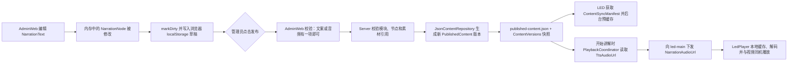
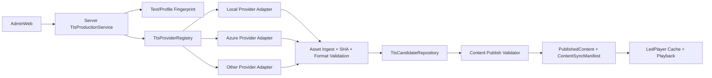

# Phase 9 — 正式 TTS 内容生产闭环 Architecture Discovery

## 0. 审计范围与结论

- 审计基线：`f075fbe3ab96c3b202b67acedc0baf1be51a4e8e`
- 审计日期：2026-08-31
- 事实来源：当前本地源码。旧文档只用于理解产品目标，不用于覆盖源码事实。
- 本轮范围：Architecture Discovery。未安装 TTS 库、未调用外部 TTS API、未修改 Server、Contracts、AdminWeb、TouchClient 或 LedPlayer 业务代码。

结论：当前系统已经具备“讲解文案字段、讲解音频 URL、手工音频上传、TTS API 形状、内容发布/回滚、LED 音频缓存和播放”这些零散基础，但**尚未形成正式 TTS 内容生产闭环**。当前最危险的缺口不是缺少某家 TTS SDK，而是 `NarrationText` 与 `TtsAudioUrl` 之间没有任何一致性约束：管理员修改文案后，旧音频仍然保留并可继续发布；反过来，只有文案而没有音频的节点也能发布，运行时不会自动合成语音。

正式运行中的音频归属已经明确：**讲解音频最终由 LedPlayer 所在的 LED 播放主机输出，不是 TouchClient。** Server 只把播放工作派给 `led-main`，LedPlayer 在同一进程内准备视频与讲解音频，并按统一计划时间启动两路媒体。

## 1. 当前真实架构

### 1.1 与 TTS 有关的现有数据模型

| 层 | 当前字段/类型 | 真实语义 | 当前缺口 |
|---|---|---|---|
| 内容模型 | `NarrationNode.NarrationText` | 管理员编辑的讲解文案 | 只是字符串，不会触发生成，也没有内容指纹 |
| 内容模型 | `NarrationNode.TtsAudioUrl` | 讲解音频地址 | 只是可空 URL，不是 `ContentAsset`，没有 SHA、大小、来源和文案绑定 |
| 素材模型 | `ContentAsset` | `Url + Sha256 + SizeBytes + DurationSeconds` | 普通素材完整；TTS URL 没有使用这套完整元数据 |
| 素材类型 | `AssetKind.NarrationAudio` | 手工上传讲解音频时使用的类型 | 上传结果的完整元数据在 AdminWeb 中被丢弃，只留下 URL |
| 生成 API | `TtsSynthesisRequest` | 文字、音色、语速、音量、音调 | 没有节点、版本、幂等键、输出格式和文案指纹 |
| 生成 API | `TtsSynthesisResult` | 音频 URL、时长、Provider Request ID | 没有本地资产身份、SHA、大小、候选状态和采用状态 |
| 播放协议 | `PlaybackCommand.NarrationAudioUrl` | Server 下发给实际播放端的讲解音频地址 | 运行时字段，不应承担内容生产和版本一致性职责 |
| 同步协议 | `ContentSyncAsset` | LED 下载时使用 URL、SHA 和大小 | 当前 TTS 项被填为“空 SHA + 0 字节” |

源码入口：

- `.NET` 内容模型：`src/Shared/TG.Control.Contracts/DomainModels.cs:1-49`
- `.NET` TTS/播放/同步契约：`src/Shared/TG.Control.Contracts/PlaybackContracts.cs:43-110`
- Unity 对应字段：`src/Shared/UnityContracts/Runtime/Contracts.cs:22-38`、`src/Shared/UnityContracts/Runtime/Contracts.cs:136-160`
- AdminWeb 对应 TypeScript 接口：`src/AdminWeb/src/api.ts:1-10`

`TtsAudioUrl` 和 `NarrationAudioUrl` 不是两套音频：前者是内容编辑/发布模型中的字段，后者是播放时由 Server 从前者映射到 `PlaybackCommand` 的运行时字段。

### 1.2 管理员修改 NarrationText 以后的当前完整数据流



当前数据流中不存在以下步骤：

- 修改文案时清空或标记旧音频过期；
- 自动调用 TTS；
- 校验音频是否由当前文案生成；
- 生成后试听和显式采用；
- 发布时校验文案指纹与音频指纹一致；
- 将 TTS 结果作为带 SHA-256 的正式 `ContentAsset` 持久化。

AdminWeb 在输入事件中直接执行 `node.narrationText = textarea.value`，然后保存浏览器草稿；它不会触碰 `node.ttsAudioUrl`（`src/AdminWeb/src/main.ts:185-200`）。草稿只保存在当前浏览器，并且只在草稿的 `baseVersion` 等于当前正式版本时恢复（`src/AdminWeb/src/main.ts:244-255`）。因此当前没有 Server 端内容草稿，也没有并发编辑或 TTS 任务的持久上下文。

发布前，AdminWeb 与 Server 都采用“`NarrationText` 和 `TtsAudioUrl` 至少有一项”的规则（`src/AdminWeb/src/main.ts:247-252`、`src/Server/TG.Control.Server/ContentValidator.cs:40-41`）。所以：

1. 只有文案、没有音频的节点可以发布；
2. 文案已变化、音频仍指向旧 MP3 的节点也可以发布；
3. 只有音频、没有文案的节点也可以发布。

### 1.3 当前 TTS 按钮和手工上传的真实行为

AdminWeb 已有“生成 TTS”按钮、上传音频入口和 TTS 状态徽标：

- `GET /api/tts/status` 返回 Provider、默认音色和 `configured`；
- “生成 TTS”直接调用 `POST /api/tts/synthesize`；
- 成功后直接把响应的 `audioUrl` 写入 `node.ttsAudioUrl`；
- 没有试听播放器、候选音频、采用/放弃、生成历史或过期提示；
- 手工上传使用 `AssetKind.NarrationAudio`，Server 会返回完整 `ContentAsset`，但 AdminWeb 只保存 `asset.url`，把 SHA、大小、时长和资产 ID 丢弃（`src/AdminWeb/src/main.ts:203-216`）。

当前 Server 并没有可用 TTS Provider。依赖注入始终注册 `UnconfiguredTtsService`，其唯一行为是抛出“provider is not configured”（`src/Server/TG.Control.Server/Program.cs:9-23`、`src/Server/TG.Control.Server/TtsService.cs:5-14`）。更需要注意的是，`/api/tts/status` 只根据配置文本是否等于 `NotConfigured` 判断“已配置”，并不检查实际注入的 Provider。因此仅修改 `appsettings.json` 的 Provider 名称，可能让 AdminWeb 按钮变为可用，但生成接口仍然失败。

### 1.4 素材上传、SHA-256 与发布校验

普通素材上传链路已经具备可复用基础：

1. AdminWeb 以流式请求上传素材；
2. `AssetStorage.SaveAsync` 流式写入 GUID 文件名的新文件；
3. 写入过程中使用 `IncrementalHash(SHA256)` 计算 SHA-256；
4. 失败或空文件会删除不完整目标；
5. 返回 `ContentAsset`，包括 URL、SHA、大小和时长（`src/Server/TG.Control.Server/AssetStorage.cs:87-132`）；
6. 发布普通素材时，Server 校验文件真实存在、非空、大小和 SHA-256（`src/Server/TG.Control.Server/AssetStorage.cs:28-75`、`src/Server/TG.Control.Server/ContentValidator.cs:43-54`）。

但 TTS 音频绕开了这套完整性语义：

- 发布只用 URL 检查服务器文件存在且非空，不检查预期大小和 SHA（`src/Server/TG.Control.Server/ContentValidator.cs:56-62`）；
- 内容清单把 TTS 音频写为 `ContentSyncAsset(url, "", 0)`（`src/Server/TG.Control.Server/Program.cs:68-84`）；
- 因此 LED 对 TTS 缓存只能确认“文件存在且非空”，无法像视频一样发现同 URL 内容损坏或被替换。

外部素材 URL 不能正式发布。`AssetStorage.ValidatePublishedReference` 要求绝对 URL 属于本 Server/loopback，且路径位于 `/media/`；所以未来 Provider 返回 Azure 或其他供应商的临时 URL 时，不能直接把该 URL 写入正式内容。Server 必须先把生成结果收归本地 Asset 体系。

### 1.5 Publish 与 Rollback

当前发布语义：

- Server 先执行 `ContentValidator`；失败时不会调用 Repository，当前正式版本不变；
- 校验通过后，`JsonContentRepository.SaveAsync` 生成递增版本；
- 先以临时文件替换 `published-content.json`，再在 `Data/ContentVersions/content-vXXXXXXXX.json` 保存完整内容快照（`src/Server/TG.Control.Server/ContentRepository.cs:55-72`、`src/Server/TG.Control.Server/ContentRepository.cs:139-163`）。

当前回滚语义：

- 读取历史版本；
- 对历史版本中引用的当前物理文件重新执行发布校验；
- 校验通过后，以历史模块数据生成一个新的递增正式版本，而不是把版本号倒退（`src/Server/TG.Control.Server/Program.cs:120-134`、`src/Server/TG.Control.Server/ContentRepository.cs:112-132`）。

这意味着历史 JSON 是快照，但媒体文件并没有随版本复制。`DELETE /api/assets/{storedName}` 也没有引用检查；如果某个仍被历史版本引用的文件被删除，该版本将无法回滚。Phase 9 必须把 TTS 文件视为不可变资产，并在建立垃圾回收前保护所有正式版本、候选和草稿引用。

### 1.6 LED 下载、缓存与实际播放选择

LED 启动后会周期性获取 `/api/content/manifest`，注册每个素材的大小和 SHA，随后后台预下载。缓存使用 URL 的 SHA-256 作为本地文件名，支持 `.partial` 和 HTTP Range 续传；存在文件和下载完成文件都会按清单中的大小/SHA 校验（`src/LedPlayer/Assets/Scripts/LedApiClient.cs:136-210`、`src/LedPlayer/Assets/Scripts/LedContentCache.cs:19-147`）。如果开始讲解时素材还未缓存，当前节点会优先按需下载。

播放节点的选择规则在 `PlaybackCoordinator` 中是：

- 视频：节点 `Assets` 中第一个 `Video` 或 `Animation`；
- 音频：`node.TtsAudioUrl`；
- 同时存在时：向 `led-main` 下发 `PlayVideo`，命令同时携带 `MediaUrl` 和 `NarrationAudioUrl`；
- 只有音频时：向 `led-main` 下发 `PlayNarration`；
- 两者都没有时：没有期望播放客户端，该节点直接前进到下一节点（`src/Server/TG.Control.Server/PlaybackCoordinator.cs:251-290`）。

因此只有 `NarrationText` 而没有 `TtsAudioUrl`、同时又没有视频/动画的节点，会在运行时被立即越过；若有视频但没有音频，则只播放视频，不会朗读文案。

LedPlayer 的 `LedPlaybackController` 同时拥有视频播放适配器和一个 `AudioSource`。Prepare 阶段分别解析视频和讲解音频的本地缓存，Play 阶段等待统一 `executeAtUtc`，在同一 Unity 帧调用视频播放和 `AudioSource.Play()`，并在两路媒体都结束后报告完成（`src/LedPlayer/Assets/Scripts/LedPlaybackController.cs:100-238`）。它还执行 `Duck / KeepOriginal / MuteVideo` 混音策略和两路音量（同文件 `249-270`）。这正是当前声画同机联动路径。

TTS 输出格式应在 Phase 9 固定为经实际 Windows Player 验证的 MP3 或 WAV。当前 Server 接受 AAC/M4A，但 LedPlayer 的显式格式识别只有 MP3、WAV、OGG、AIFF，其他格式落到 `AudioType.UNKNOWN`（`src/LedPlayer/Assets/Scripts/LedPlaybackController.cs:312-325`），不宜把可播放性寄托在平台猜测上。

### 1.7 TouchClient 的 NarrationAudioPlayer 是遗留实现

`src/TouchClient/Assets/Scripts/NarrationAudioPlayer.cs` 仍在源码中，但当前正式架构没有使用它：

- `TouchRuntimeBootstrap` 只创建 `TouchApiClient`、`TouchControlFacade` 和 `TouchOperatorUi`，没有挂载 `NarrationAudioPlayer`（`src/TouchClient/Assets/Scripts/TouchRuntimeBootstrap.cs:10-25`）；
- 当前源码的 Scene/Prefab 也没有该组件引用；
- `PlaybackCoordinator` 只向 `settings.LedClientId` 发布 Prepare/Play/控制命令，不把 Touch 加入 `ExpectedClients`；
- 该遗留播放器读取的是 `command.mediaUrl`，而当前讲解音频位于 `command.narrationAudioUrl`，即使重新挂载也不符合当前协议（`src/TouchClient/Assets/Scripts/NarrationAudioPlayer.cs:40-90`）。

Phase 9 不应修改或重新启用这个类。正式音频继续由 LedPlayer 播放；遗留文件的删除或归档可在独立清理阶段处理。

## 2. 当前技术债与风险等级

### P0：会造成正式内容错误或无声

1. **文案与音频无绑定。** 修改 `NarrationText` 后旧 MP3 不会过期，可能出现“页面文字已更新，现场仍播放旧讲解”。
2. **文案不等于语音。** 文案字段没有任何运行时合成器；text-only 节点可发布但不会自动发声。
3. **TTS Provider 实际不可用。** 当前永远注入 `UnconfiguredTtsService`；状态接口还可能因配置文本产生假阳性。
4. **TTS 音频缺少完整性元数据。** AdminWeb 丢弃上传所得 SHA/大小，Manifest 给 TTS 音频空 SHA/0 大小。

### P1：会削弱生产闭环、恢复和可维护性

1. Provider 返回 URL 被直接当作正式音频；没有下载、原子落盘、SHA、格式校验和不可变资产化。
2. 没有“生成候选 → 试听 → 采用”，生成成功会直接覆盖当前 `ttsAudioUrl`。
3. 没有生成任务、幂等键、重试、超时、审计和候选持久化。
4. 历史版本只持有媒体 URL；直接删除物理文件会破坏回滚。
5. 当前浏览器本地草稿不能为跨浏览器或长耗时 TTS 任务提供可靠上下文。
6. 手工上传音频的实际朗读内容无法机器验证；当前 UI 也没有要求管理员确认它与当前文案一致。
7. 没有规定正式输出编码、采样率、声道和响度，存在 Provider/Windows 解码差异。

### P2：结构和诊断债务

1. `ITtsService` 同时被当成供应商接口和业务入口，缺少“生产编排”层。
2. TTS DTO 位于 `PlaybackContracts.cs`，内容生产与运行时播放边界混在一起。
3. 没有生成/采用/发布失败的结构化操作日志。
4. TouchClient 遗留播放器容易让后续维护者误判音频归属。

## 3. 推荐目标架构

### 3.1 生成位置：Server 负责闭环，Provider 可进程内或独立部署

最合理的权威生成位置是 **Server 的 TTS Production Application Service**，不是 AdminWeb，也不应一开始就把全部业务放进独立 TTS Service。

原因：

- Provider 凭据不能下发到浏览器；
- Server 已经拥有登录授权、素材存储、SHA、发布、版本和审计；
- 只有 Server 能在同一可信边界内保证“当前文案指纹 → 生成结果 → 本地资产 → 发布校验”；
- AdminWeb 应只负责编辑、发起、试听和采用，不负责调用供应商或保管文件；
- V1 可以使用 Server 进程内 Provider Adapter。若 Local 引擎需要常驻 GPU/独立进程，或未来要排队扩容，可以把“原始合成执行器”迁成独立 TTS Worker/Service，但它仍隐藏在同一个 `ITtsProvider` 端口后，不能成为内容版本的权威来源。

推荐边界：



业务层不得出现 `AzureSpeech...`、某云厂商 Voice ID 或 SDK 类型。业务只识别 Provider Key、逻辑 Voice Profile 和标准化输出信息。

### 3.2 推荐核心接口

以下是职责建议，不是本轮代码变更：

```text
ITtsProvider
  Descriptor/Capabilities
  SynthesizeAsync(TtsProviderRequest, CancellationToken)
  -> 返回音频流/临时文件、媒体类型、ProviderRequestId 和供应商元数据

ITtsProductionService
  GenerateCandidateAsync(actor, nodeContext, text, profile, idempotencyKey)
  GetCandidateAsync(candidateId)
  AdoptCandidateAsync(candidateId, currentText, currentProfile)
  DiscardCandidateAsync(candidateId)

ITtsFingerprintService
  ComputeTextSha256(text, algorithmVersion)
  ComputeProfileSha256(profile, algorithmVersion)

ITtsCandidateRepository
  保存 Pending/Generating/Ready/Failed/Adopted/Discarded 状态、资产和错误摘要

IAssetIngestService（可由现有 AssetStorage 演进）
  原子接收生成流
  校验非空、格式、可解码性、时长
  计算 SHA-256 和大小
  生成不可变 /media URL
```

Provider 返回的临时 URL 只能作为下载输入，不能进入正式内容。`TtsProductionService` 必须把响应完整下载/接收、校验并收归 `ContentAsset` 后，才允许候选进入 Ready。

### 3.3 文案变更如何使旧语音自动过期

必须同时实现客户端即时反馈和 Server 强制校验，不能只依赖前端。

建议引入两个版本化指纹：

- `SourceTextSha256`：对 `tts-text-v1 + UTF-8 + Unicode NFC + LF 标准换行 + 文案正文` 计算 SHA-256；不应随意折叠标点或正文内部空白，因为它们可能影响发音。
- `SynthesisProfileSha256`：对 Provider Key、逻辑 Voice、语速、音调、音量、输出编码、采样率、声道和 Profile Schema Version 的规范 JSON 计算 SHA-256。

生成候选时记录两个指纹；采用时把它们写入音频绑定。每次编辑文案后 AdminWeb 立即重新计算或请求 Server 计算，并把不匹配的已采用音频显示为“讲解词已修改，语音已过期”。发布时 Server 再独立计算：

```text
binding.SourceTextSha256 != Hash(node.NarrationText)
或
binding.SynthesisProfileSha256 != Hash(node.TtsProfile)
=> 禁止发布该节点，并明确指出模块、节点和原因
```

前端清空 URL 不是充分方案，因为它会丢失旧候选的试听/回退能力，也无法防止恶意或旧客户端绕过。正确模型是保留旧绑定但显式 `Stale`，正式发布由 Server 拒绝。

### 3.4 生成音频如何进入 Asset/SHA/Publish/Rollback

推荐新增一个可空、可版本化的内容绑定，而不是继续扩展裸 URL：

```text
NarrationAudioBinding
  Asset: ContentAsset               // Kind 必须是 NarrationAudio
  SourceTextSha256: string
  SynthesisProfileSha256: string
  Origin: Generated | Uploaded | Legacy
  ProviderKey: string?
  VoiceProfileKey: string?
  ProviderRequestId: string?
  GeneratedAtUtc: DateTimeOffset?
  FingerprintVersion: string
```

完整链路：

1. Provider 结果先写临时文件；
2. 写入完成并通过格式/解码检查后，原子移动到不可变 `/media/{id}.{ext}`；
3. 计算并保存 `ContentAsset.Sha256/SizeBytes/DurationSeconds`；
4. 创建 `TtsCandidate`，此时不修改正式内容；
5. 管理员试听并“采用”后，浏览器草稿的节点获得 `NarrationAudioBinding`；
6. 发布时 Server 校验指纹、资产存在、大小、SHA、格式和资产类型；
7. `PublishedContent` 版本快照包含完整绑定；
8. `/api/content/manifest` 从 `binding.Asset` 生成真实 URL/SHA/大小；
9. LedPlayer 继续使用现有预缓存、断点续传、校验和播放路径；
10. 回滚时历史版本恢复同一个不可变资产和指纹，先重新验证文件完整性。

禁止用固定文件名覆盖旧 MP3。相同文字/配置可通过幂等键或内容指纹复用同一候选，但已发布资产本身必须不可变。

### 3.5 是否需要修改 Contracts

**需要，但可以把运行时影响控制为最小的向后兼容增量。**

推荐最小方案：

1. 在内容域 Contracts 增加 `NarrationAudioBinding`，并在 `NarrationNode` 末尾增加可空 `NarrationAudio`；
2. 暂时保留现有 `TtsAudioUrl` 一个迁移周期，用于读取旧版本和兼容现有 Unity 内容模型；新发布版本由 Server 同时派生/回填兼容 URL；
3. `PlaybackCommand.NarrationAudioUrl` 不需要改变；播放端不需要了解 Provider、文字指纹或候选状态；
4. `ContentSyncAsset` 不需要改变，它已经拥有 URL、SHA、大小；只需让 TTS 音频真正填入这三个值；
5. 现有 `TtsSynthesisRequest/Result` 不足以描述生产任务。应新增 Candidate/Job DTO，而不是继续给 `TtsSynthesisResult` 堆可选字段；
6. AdminWeb TypeScript 接口需要同步增加 binding、candidate、profile 和状态；
7. Unity `NarrationNode` 在兼容期可继续读取 `ttsAudioUrl`。只有 TouchClient 需要展示“音频已就绪/已过期”时才需要增加只读 binding 摘要，LedPlayer 无需消费内容生产字段。

建议的公开 API 形状：

```text
GET    /api/tts/providers
POST   /api/tts/candidates                // 202 Accepted；支持 Idempotency-Key
GET    /api/tts/candidates/{candidateId}  // Pending/Generating/Ready/Failed
POST   /api/tts/candidates/{candidateId}/adopt
DELETE /api/tts/candidates/{candidateId}
```

具体路径可在实施前再冻结，但必须保留“生成候选”和“采用到草稿”两个动作，不能恢复为一次调用直接覆盖正式音频 URL。

### 3.6 推荐 AdminWeb 交互

每个讲解节点的 TTS 区域至少增加：

1. **文案状态**：未填写、待生成、生成中、可试听、已采用、已过期、失败。
2. **Voice Profile**：展示逻辑音色、语速、音调；只展示 Server 返回的可用能力，不暴露供应商密钥。
3. **生成/重新生成**：空文案禁用；提交后显示真实任务状态，防止重复点击。
4. **试听**：使用 Candidate 的 Server 本地媒体 URL；生成完成不自动采用。
5. **采用/放弃**：明确区分候选与当前已采用音频。
6. **元信息**：来源、音色、时长、生成时间；Provider Request ID 只放诊断详情，不作为普通用户主信息。
7. **过期警告**：文案或 Profile 变化后立即显示，保留旧音频用于对比，但禁止把它作为当前有效音频发布。
8. **发布前检查**：逐模块/节点显示“文案已绑定有效语音、文件存在、SHA 正确”；错误必须明确定位。
9. **手工上传**：继续保留，但上传后必须先试听并执行“绑定到当前讲解词”。系统只能证明绑定发生时的文案指纹，不能证明人工 MP3 实际朗读内容，UI 应明确这是发布人的确认责任。
10. **失败恢复**：生成失败时显示可理解原因和重试；不删除旧候选，不改变当前正式发布版本。

当前浏览器草稿可在 Phase 9 初期继续使用，但 Candidate 必须由 Server 持久化。若要实现多电脑接续编辑，再单独把整个内容草稿迁到 Server，不应把它偷偷混入第一版 TTS 闭环。

### 3.7 TTS 失败如何保证正式版本不受影响

隔离规则应是：

- 合成只写 Candidate/临时资产区，不写 `published-content.json`；
- Provider 失败、超时、返回空内容、格式无效、下载中断、SHA/解码失败时，Candidate 标记 Failed；
- 临时文件失败即删除，只有完整校验后才原子进入正式 Asset 存储；
- 生成成功也不自动采用，更不自动发布；
- 采用只改变未发布草稿绑定；
- Publish 仍是改变正式内容的唯一入口；
- Publish 校验失败时 Repository 不落新版本，当前正式版本和 LED 已缓存版本继续工作；
- Rollback 只使用已发布快照，不依赖正在生成的 Candidate；
- Candidate 清理不得删除任何被当前/历史正式版本引用的资产。

由此，哪怕 TTS 服务完全不可用，已发布并已缓存的正式版本仍可继续播放；受影响的只是新文案无法完成“有效语音”门禁，不能发布坏版本。

### 3.8 可插拔 Provider 设计

Provider 必须通过注册表/工厂按 `ProviderKey` 选择：

- `Local` Adapter 负责本地引擎进程、模型和文件/流返回；
- `Azure` Adapter 负责 Azure SDK、凭据、限流和错误映射；
- 其他正式 Provider 实现同一接口；
- 供应商配置放 Server 安全配置或密钥存储，不进入 Contracts、AdminWeb 或 PublishedContent；
- PublishedContent 可记录 Provider Key、逻辑 Voice 和生成请求 ID 用于审计，但运行时播放不依赖供应商；
- 业务错误统一映射为可重试/不可重试/配置错误/配额或限流/内容不支持，AdminWeb 不直接显示 SDK Exception；
- 统一输出协议优先规定为 MP3 或 WAV，并固定采样率、声道和响度目标。

不要让 `ITtsProvider` 负责发布，也不要让 Provider 返回的 URL成为正式内容地址。供应商更换只影响“如何产生候选音频”，不影响 Asset、Publish、Rollback、Manifest 和 LedPlayer。

## 4. 对现有系统各部分的预期影响

### 4.1 Server

需要增加：

- Provider 抽象与注册表；
- TTS Production Application Service；
- Candidate/Job Repository；
- 文案/Profile 指纹服务；
- 生成音频的 Asset Ingest；
- 发布时的绑定一致性和完整性校验；
- Provider/候选状态 API；
- Generate/Adopt/Fail/Publish 的 JSONL 操作日志；
- 对历史版本、当前版本和 Candidate 的资产引用保护。

现有 `JsonContentRepository` 的版本生成和回滚语义可以保留。现有 `AssetStorage` 的流式写入/SHA 基础可以复用，但需要一个不依赖 `HttpRequest` 的内部导入接口。

### 4.2 AdminWeb

需要把“一个 URL + 一个生成按钮”升级为候选生产工作台：文案状态、Profile、生成任务、试听、采用、过期、失败、发布前检查和手工音频确认。发布动作仍发送整个内容草稿，但必须携带完整音频绑定。

### 4.3 LedPlayer

**不需要增加 TTS Provider，也不需要改变播放状态机。** 当前“LED 主机同时播放视频与讲解音频”的归属正确。

最小必要影响是：

- Server Manifest 为讲解音频提供真实 SHA/大小；
- PlaybackCoordinator 从新 binding 的 Asset URL 生成现有 `NarrationAudioUrl`；
- 对 MP3/WAV 输出做 Windows Player 实机解码回归；
- 验证生成音频参与后台预缓存、按需下载、Pause/Resume/Retry/Skip/Stop 和 Session 恢复。

如果兼容 URL 继续由 Server 派生，`LedPlaybackController`、`PlaybackCommand` 和 `LedContentCache` 原则上无需结构修改。

### 4.4 TouchClient

Phase 9 内容生产不需要 TouchClient 播放音频，也不应恢复 `NarrationAudioPlayer`。TouchClient 继续展示并控制 Server 的真实 Session。若产品未来需要在路线编辑或状态页显示“内容音频已就绪”，应只增加只读状态，不把生成能力放到现场触控端。

### 4.5 Publish / Rollback

- 新版本必须快照完整 `NarrationAudioBinding`；
- Publish 对文案/Profile 指纹和 Asset SHA 做强校验；
- Manifest 从 binding 的 Asset 元数据生成 TTS 清单项；
- Rollback 继续“历史版本生成新版本”，但恢复前验证音频 Asset；
- 旧正式版本保持可播放，不因 Candidate 失败而变化；
- 媒体删除必须增加引用检查；正式资产垃圾回收需要扫描当前版本、全部历史版本和未过期 Candidate。

## 5. 兼容与迁移策略

不能把现有 `TtsAudioUrl` 一次性当成“已验证绑定”，否则会给旧音频与当前文字的一致性背书。建议：

1. 读取旧内容时标记为 `Legacy`；
2. 对本 Server `/media/` 文件补算 SHA、大小和时长，生成资产元数据；
3. 不自动声称旧音频与当前文案相符；AdminWeb 显示“历史音频，待确认/重新生成”；
4. 未修改的现有正式版本继续播放；
5. 对某节点的文案进行修改后，该节点必须重新生成或人工确认绑定，才能发布；
6. 经过一个兼容周期并完成数据迁移后，再停止写入裸 `TtsAudioUrl`。

这样既不会破坏 Phase 8 的现有正式版本，也不会把旧数据永久排除在新的安全门禁之外。

## 6. 建议的 Phase 9 子阶段

### Phase 9.1 — 领域模型、状态机和兼容策略

- 冻结 `NarrationAudioBinding`、Candidate 状态、Text/Profile 指纹算法和正式音频格式；
- 增加 Contracts 的向后兼容字段；
- 建立 Legacy 数据读取/迁移测试；
- 明确 text-only、audio-only 和手工上传的发布策略。

验收重点：旧正式内容可读取、可播放；新模型不会把旧 URL 自动标为已验证。

### Phase 9.2 — Server 生产内核与可插拔 Provider 边界

- 建立 `ITtsProvider`、Registry、`ITtsProductionService`、Candidate Repository；
- 建立不依赖 HTTP 上传的 Asset Ingest、SHA、原子落盘和音频格式校验；
- 使用测试 Provider 完成失败、超时、重试、幂等和审计测试；
- 暂不接正式供应商也能验证完整业务边界。

### Phase 9.3 — AdminWeb 生成、试听、采用闭环

- 文案/Profile 过期检测；
- 生成任务状态；
- 试听、采用、放弃、重新生成；
- 手工音频绑定确认；
- 刷新/重进页面后恢复 Candidate 状态。

验收重点：生成成功不能自动覆盖已采用音频；改文案后立即显示过期。

### Phase 9.4 — Publish、Manifest、Rollback 和资产保留

- Server 发布强校验；
- TTS Asset 的真实 SHA/大小进入 Manifest；
- 回滚完整性验证；
- 删除引用保护和 Candidate 清理策略；
- 证明 TTS 失败或坏草稿发布失败时当前正式版本不变。

### Phase 9.5 — 首个正式 Provider

- 在 Local 或 Azure 中选择一个作为首个正式 Adapter；
- 凭据/模型配置、逻辑 Voice 映射、限流、错误映射；
- 输出 MP3/WAV 标准化和真实中文长文本测试；
- 不把供应商类型泄漏到业务层。

另一个 Provider 应用契约测试证明可插拔，而不是复制业务流程。

### Phase 9.6 — 三端集成与交付验收

- 编辑 → 生成 → 试听 → 采用 → 发布 → LED 预缓存 → 声画播放；
- 改文案后旧音频发布门禁；
- Provider 失败、Server 重启、Admin 刷新、LED 离线/恢复；
- Pause/Resume/Retry/Skip/Stop、Session 恢复；
- 回滚到含旧 TTS 资产的历史版本；
- 中文长文、标点、多音字、数字英文混排、音量和真实声画偏差测试。

Phase 9.6 完成前，不能仅凭“接口返回了 MP3”宣布正式 TTS 闭环完成。

## 7. 关键决策摘要

| 问题 | 审计答案 |
|---|---|
| 修改 NarrationText 后当前会发生什么？ | 只更新 AdminWeb 内存和浏览器草稿；旧 `TtsAudioUrl` 不变。点击发布后可与新文字一起进入新版本。 |
| 为什么有文字不等于有语音？ | 当前没有自动合成触发或运行时 TTS；发布规则还允许 text-only。 |
| 音频最终由谁播放？ | LedPlayer/LED 播放主机；TouchClient 遗留播放器未挂载且不兼容当前字段。 |
| 正式生成应放在哪里？ | Server 的 TTS Production Service；底层 Provider 可进程内或以后独立 Worker。 |
| 音频如何进入现有体系？ | Provider 结果先收归不可变 `ContentAsset`，计算 SHA/大小/时长，再作为 Candidate 被采用和发布。 |
| 是否改 Contracts？ | 需要。最小为添加可空 `NarrationAudioBinding`；保留 `TtsAudioUrl` 过渡。PlaybackCommand 可不改。 |
| 如何避免旧 MP3？ | Text/Profile 指纹绑定，前端即时标记 Stale，Server 发布强制重算并拒绝不一致。 |
| TTS 失败会否影响正式版本？ | 不应。生成只写 Candidate，Publish 才能改变正式版本；失败不修改 PublishedContent。 |
| 如何支持 Local/Azure/其他 Provider？ | `ITtsProvider + Registry`，供应商只负责合成，业务层统一完成资产化、候选、采用、发布和审计。 |
| LedPlayer 是否需要重写？ | 不需要。保留现有同机声画播放；主要修正 Server Manifest 的音频 SHA/大小并做格式与回归验证。 |

本 Discovery 到此停止，不实施 TTS。
